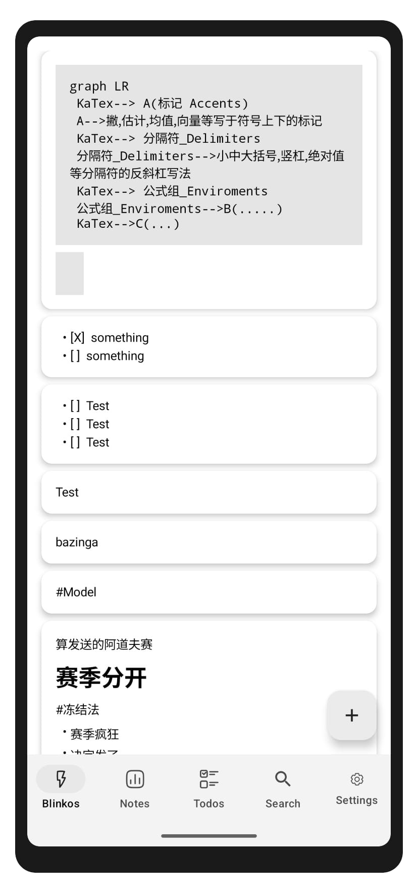
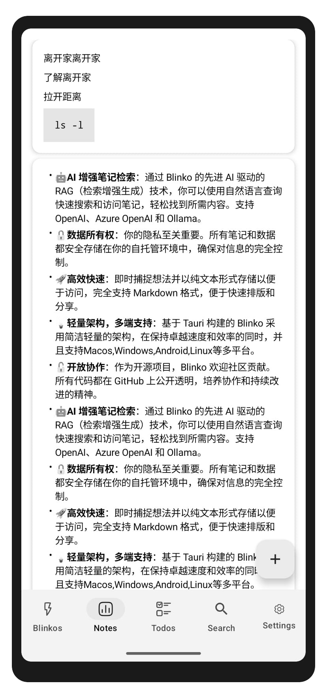
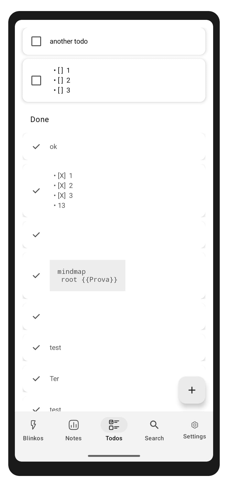
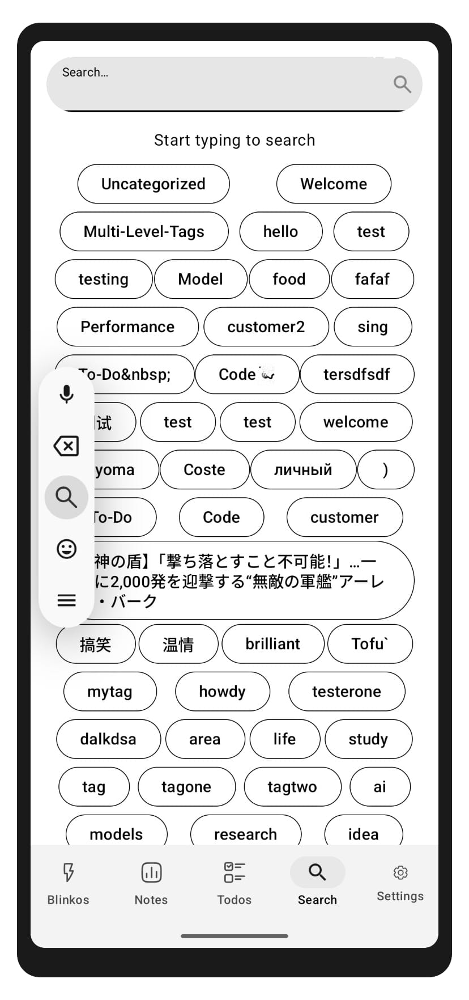
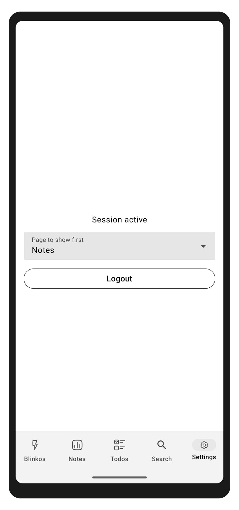

# Blinko Android

[](https://github.com/pepitoria/BlinkoAndroid/releases)
[](LICENSE)
[](https://developer.android.com)

An unofficial Android client for [Blinko](https://github.com/blinko-space/blinko) — the open-source, self-hosted note-taking app.

## Screenshots

<p align="center">
  
  
  
  
  
</p>

## Features

- **Notes Management** — Create, edit, and delete blinkos, notes, and todos
- **Organization** — Archive notes and mark todos as complete
- **Search** — Find notes by text or filter by tags
- **Share Integration** — Share URLs or text from other apps directly to Blinko
- **Secure** — Connects to your self-hosted Blinko instance

## Installation

The app is not available on Google Play. Choose one of these methods:

### Obtainium (Recommended)

[Obtainium](https://github.com/ImranR98/Obtainium) automatically checks for updates and notifies you when new versions are available.

1. Install Obtainium from [F-Droid](https://f-droid.org/packages/dev.imranr.obtainium.fdroid/) or [GitHub](https://github.com/ImranR98/Obtainium/releases)
2. Add this repository: `https://github.com/pepitoria/BlinkoAndroid`
3. Install and enjoy automatic updates

### Direct Download

Download the latest APK from the [Releases](https://github.com/pepitoria/BlinkoAndroid/releases) page.

### Build from Source

> **Note:** This method is not recommended for most users. Building from source requires configuring your own signing keys, which can be complex.

```bash
git clone https://github.com/pepitoria/BlinkoAndroid.git
cd BlinkoAndroid
./gradlew assembleRemoteRelease
```

The APK will be in `app/build/outputs/apk/remote/release/`.

## Requirements

- Android 7.1 (API 25) or higher
- A running [Blinko](https://github.com/blinko-space/blinko) server instance

## Roadmap

- [ ] Login with token authentication
- [ ] Advanced search (multiple terms/tags)
- [ ] Tag suggestions while editing
- [ ] Offline mode with sync
- [ ] Dark theme improvements

## Contributing

Contributions are welcome! Whether it's bug reports, feature requests, or pull requests — all help is appreciated.

See [README-DEV.md](README-DEV.md) for technical documentation and architecture details.

## Disclaimer

This is an independent project and is **not affiliated** with the official Blinko project. Use at your own risk.

## License

This project is open source. See the [LICENSE](LICENSE) file for details.

